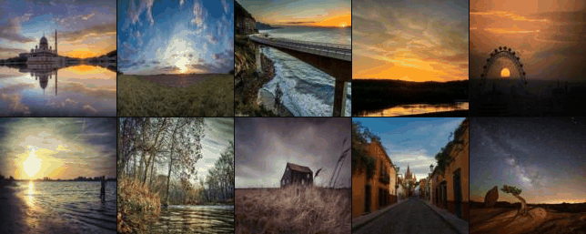
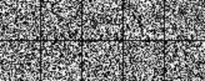
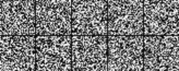
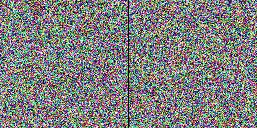
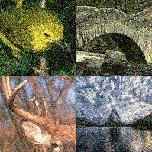
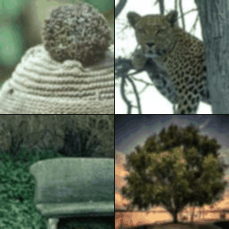

# Trust the Critics

   
   
  <b> Real world photographs being translated into simulated Monet paintings by TTC. </b>

This repository is the official implementation of "Trust the Critics" (TTC), the mutilpurpose transport algorithm described in [*A new method for determining Wasserstein 1 optimal transport maps from Kantorovich potentials, with deep learning applications*](https://arxiv.org/abs/2211.00820). It is written in PyTorch.

Given two datasets each representing a probability distribution, i.e. a "source" μ and a "target" ν, TTC uses critic networks like those from [WGAN-GP](https://github.com/igul222/improved_wgan_training) to learn a transport map from μ to ν. Roughly speaking, the idea is to start at samples from the source distribution μ and iteratively take gradient descent steps on critic networks, with carefully selected step sizes, until the target distribution ν has been reached. Importantly, training the critic networks does not require prior knowledge of pairings between samples from μ and ν, so TTC is trained through unsupervised learning. The only strict requirement is that the two distributions must inhabit the same dimension, so TTC is a highly versatile algorithm. For a precise description of how TTC works, refer to Algorithm 1 in the paper.

We have tested TTC on four distinct types of imaging problems: denoising (using the [BSDS500](https://www2.eecs.berkeley.edu/Research/Projects/CS/vision/grouping/resources.html#bsds500) dataset), generation ([MNIST](https://yann.lecun.com/exdb/mnist/), [Fashion-MNIST](https://github.com/zalandoresearch/fashion-mnist) and [CelebaHQ](https://github.com/tkarras/progressive_growing_of_gans)), translation ([Photo](https://github.com/junyanz/pytorch-CycleGAN-and-pix2pix) to [Monet](https://github.com/junyanz/pytorch-CycleGAN-and-pix2pix)) and deblurring (BSDS500). Each of the animations shown here displays the evolution of selected source samples as they are transported by an instance of TTC trained for one of these applications.

## How to run this code ##
* Create a Python virtual environment with Python 3.8.
* Install the packages listed in requirements.txt (pip install -r requirements.txt)
* Train an instance of TTC by running train.py — the results will be saved in a directory specified by the --folder argument (this directory should either not exist or be empty when running train.py).
* Evaluate the results by running denoise_eval.py or fid_eval.py, or create images with TTC by running make_images.py, specifying the same directory with the --folder argument.
* If desired, resume training by running train.py again, specifying the same directory with the --folder argument — new critics and TTC steps will be added to the previous results.

Illustrating its flexibility, TTC can be trained for all four applications reported here (and many more) using the same train.py script; the only necessary changes are the source and target datasets, specified by the 'source' and 'target' arguments (which should be paths to appropriate datasets, or source='noise' for image generation). The other scripts that may be run from the command line are denoise_eval.py (evaluates PSNR, use only for denoising experiments), fid_eval.py (evaluates FID, use only for generation experiments) and make_images.py (creates images with TTC in various ways). For detailed explanations of the arguments and options for each of these scripts, use the -h flag from the command line (e.g. > python train.py -h). We include examples of the shell scripts we used to run our experiments in the example_shell_scripts folder. The settings we used for our experiments with TTC are reported in Section 5 and Addendix 8 of the paper. Note that training TTC is computationally demanding, and thus requires adequate resources (i.e. running this on a regular laptop is not recommended).

  
  
  
   
  <b> Image generation with TTC is achieved by using Gaussian noise as the source distribution (instead of a dataset). Here are selected results obtained when using MNIST, Fashion-MNIST and CelebaHQ as the target dataset. </b>

### Computing architectures and running times
We ran the code presented here on computational clusters provided by the Digital Research Alliance of Cananda (https://alliancecan.ca/en), always using a single NVIDIA P100 or V100 GPU. Training times are reported in Addendix 8 of the paper.

## Performance metrics and benchmark methods 
As reported in the paper, we measured the performance of TTC on denoising and generation tasks using PSNR and FID, respectively. We also compared the results to a benchmark method for each of these two cases, namely adversarial regularization (Lunz et al. 2018) for denoising and WGAN-GP (Gulrajani et al. 2017) for generation. Our implementation of adversarial regularization is included in the present codebase within the denoise_eval.py script — running this script (on an instance of TTC trained for denoising) while specifying the --benchmark flag will result in PSNR being evaluated for both TTC and adversarial regularization. The FID performance of an instance of TTC trained for image generation can be evaluated using the fid_eval.py script, but our implementation of the  WGAN-GP benchmark is contained in a different repository (link coming soon).

  
  
   
  <b> Examples of image denoising (left) and deblurring with TTC. </b>

## Assets 
Portions of this code, as well as the datasets we used for our experiments, make use of existing assets. Here is a list of all assets used, along with the licenses under which they are distributed, if specified by the originator:
- **pytorch_fid**: from https://github.com/mseitzer/pytorch-fid. Distributed under the Apache License 2.0.
- **MNIST dataset**: from http://yann.lecun.com/exdb/mnist/. Distributed under the Creative Commons Attribution-Share Alike 3.0 license.
- **Fashion MNIST datset**: from  https://github.com/zalandoresearch/fashion-mnist ((c) 2017 Zalando SE, https://tech.zalando.com). Distributed under the MIT licence.
- **CelebA-HQ dataset**: from https://paperswithcode.com/dataset/celeba-hq
- **Image translation datasets**: from https://github.com/junyanz/pytorch-CycleGAN-and-pix2pix ((c) 2017, Jun-Yan Zhu and Taesung Park). Distributed under the BSD licence.
- **BSDS500 dataset**: from https://www2.eecs.berkeley.edu/Research/Projects/CS/vision/grouping/resources.html.
